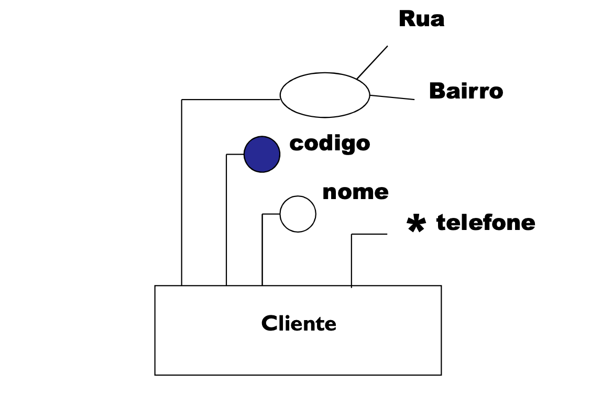

 # SGBD
    |> Sistema Gerenciador de Banco de Dados
        |> Gerencia o acesso e a manutenção dos dados arrmazenados 
            |> Tudo passa pelo SGBD
                |> Salva os dados no HD, ligam dados e metadados, encripta dados, ccontrola o acesso, faz um backup caso os dados sejam danificados
                    |> É o "sistema operacional" do banco de dados, sem ele nada funciona

    ** Regrinhas de SGBD

        - Auto-Contennção 
            |> Organiza e junta os dados para eles voltarem completos, organização dos dados
        
        - Inddependência dos dados
            |> A modelagem do banco NUNCA pode ser acessada ou modificada por software externo ou usuário

        - Abstração de dados
            |> o usuario não pode ter acesso direto ao banco de dados

        - Visões
            |> Cada usuário pode exigir ou mesmo precisar de uma visão diferenciada da base de dados, é a forma que cada um pode manipular o banco de dados
        
        - Transações
            |> Controle de concorrência , ou seja, o acesso ao mesmo dado deve ser de forma controlada e possível de acontecer, o dado pode ser usado por mais de um computador ao mesmo tempo

        - Segurançaa
            |> Segurança de acesso(usuários e aplicações)
            |> Segurança conta falhas (recovery)
            |> Monitoramento de transações, categorias de falhas, manutenção de histórico de atualizações (logs) e backups do BD
        
        - Controle de Redundância 
            |> Não deve haver uma duplicação nos dados, guardar informações repetidas

        - Interfaceamento
            |> Utilização de interface gráfica para auxilinar no desenvolvimento

        - Métodos de acesso
            |> DDL -> Data Definition Language -> especifica e altera a estrutura do banco, pode criar, apagar, modificar a modelagem, cria o espaço para o dado ficar dentro do banco de dados
            |> DML -> Data Manipulation Language -> manipula, processa os dados
            |> DCL -> Data Control Language -> responsavel pelas permissões de acesso ao banco de dados

    ** Vantagens de um SGBD

        - Rapidez na manipulação e no acesso a informação
        - Redução do esforço humano
        - Redução na redundância e a inconsistência de informações
        - Redução de problemas da integridade 
        - Compartilhamento de dados
        - Aplicação automatica de restrições de segurança
        - Controle integrado de informações distribuidas fisicamente
        - Precisão no resultao da informação
        - Maior disponiilidade dos dados
        - Tempo de desenvolvimento reduzido do software

# Modelagem
    |> Modelagem é uma forma de obtermos resultados e esquemas puramente conceituais sobre a essência de um sistema, projeto de negócio que se esta desenvolvendo.

# MER 
    |> Modelo Entidade de Relacionamentos ( Modelo Conceitual)
        |> Representação gráfica com um levantamento junto ao cliente 
            - Entidades -> um objeto que existe no mundo real com uma identificação distinta e com um significado próprio
                |> É uma representação de uma classe de dados do negócio, ou seja, um conjunto de informações
                    |> Na hora da modelagem, as entidades são representadas por um retângulo com seu nome dentro
            - Instâncias
                |> É uma linha de uma tabela e cada tabela é uma entidade e nela existem linhas com dados diferentes
            - Atributos Simples
                |> Todo objeto para ser uma entidade possui propridades que são descritas por atriutos e valores. A junção desses atributos e valores descrevem o conceito de uma instância
                |> É representado por uma bolinha

                valor = conteúdo de um atributo
                
                atributos + atriubtos = instância
            
            - Atributos Identificador
                |> Identifica e marca qual atributo vai diferenciar a instâncias dentro da entidade,costuma ser um atributo único(que não possa ter um valor igual) dentro de todas as instâncias
                    |> Criar um Id para ser o identificador, só existe uym por entidade e vai identificar uma instância 
            - Atriutos Compostos
                |> São atributos que podem ser divididos em outros atributos, um exemplo é o endereço que para estar completo, precisa de rua, número, complemento, bairro, cep, cidade 
                |> São representados por uma bolinha que saem novos atributos
            - Atributo Multivalorado
                |> Pode ter mais de um valor
                |> O atributo multivalorado pode ser também um atributo composto, ou o multivalorado ser um dos filhos do atriuto composto

# Exemplo das entidades com seus modelos

# Relacionamento entre Entidades
    |> E representado por um losangulo

- Relacionamento de "um-para-um""
    |> Neste grau cada elemento de uma entidade relaciona-se com *SOMENTE UM ELEMENTO* de outra entidade
                
                        1                              1
  1)    Ent 1 ---------------> *Losangulo* ----------------> Ent 2

                                        (1,1)                           (1,1)       -------->  (mínimo, máximo)
  2) Tipo de Cardinalidade     Ent 1 ---------------> *Losangulo* ----------------> Ent 2

                                                 
  3)  Tipo Pé de Galinha     Ent 1 ----||----------------------||----- Ent 2 -----> | = o minimo que eles podem se relacionar e o máximo que eles podem se relacionar

- Relacionamento de "um-para-muitos""
    |> Este grau de relacionamento é um dos mais comuns no mundo real, sendo o que denominamos de ralacionamento básico entre entidades,onde um item de uma entidade pode se relacionar com vários itens de outra entidade
        |> Um elemento da entidade A relaciona-se com muiitos elementos da entidade B, mas cada elemento da entidade B somente pode estar relacionado a um elemento da entidade A

            1                      N                        N = o numero de elementos necessários
1)  Ent 1 -------> *Losangulo* -------> Ent 2

            (1,1)               (1,N)
2) Ent 1 -------> *Losangulo* -------> Ent 2

3)  Ent 1 --||----------|<-- Ent 2

- Relacionamento de "muitos-para-muitos""
    |> Um elemento da entidade A relaciona-se com muitos elementos da entidade B, mas cada elemento da entidade B pode estar relacionado a muitos elementos da entidade A

            N                     N
1) Ent 1 -------> *Losangulo* -------> Ent 2

            (N,1)               (1,N)
2) Ent 1 -------> *Losangulo* -------> Ent 2

3) Ent 1 ->|--------------|<- Ent 2

# Cardinalidade

    Mínimo
    0 ou 1  

    Máximo
    1 ou N
     
# Generalização 
    |> É a divisão de um entidade em outras duas que são opostas por causa dos seus atributos
        |> Tem dois tipos, parcial e total
            |>  Cada uma delas é repesentada por P e T respectivamente
                
                |> Generalização parcial, indica que os itens de uma entidade não são iguais a outra entidade secundária, específicas pra aquela entidade, mas consegue manter alguns atributos na entidade principal acabam virando atributos padrão, 4, 5 atributos em cima e o resto em baixo, é parcial
                
                |> Generalização total, todas os atributos dessa entidade são diferentes da outra entidade secundária, quase nenhum atributo fica na entidade principal para serem os atributos gerais, 1 atributo em cima é total

# Agregação
    |> É a junção de dois relacionadores (losângulo)
        |> é usado quando as três entidades tem a cardinalidade máxima *IGUAL*                                                         